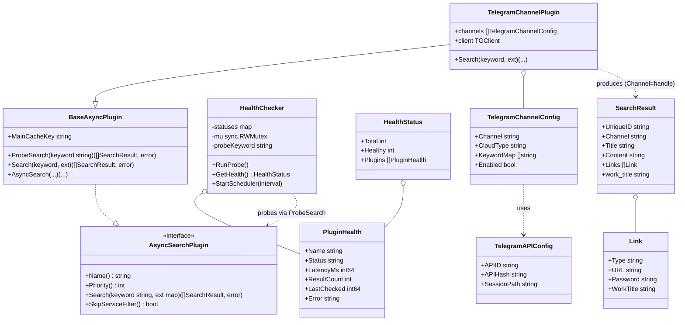
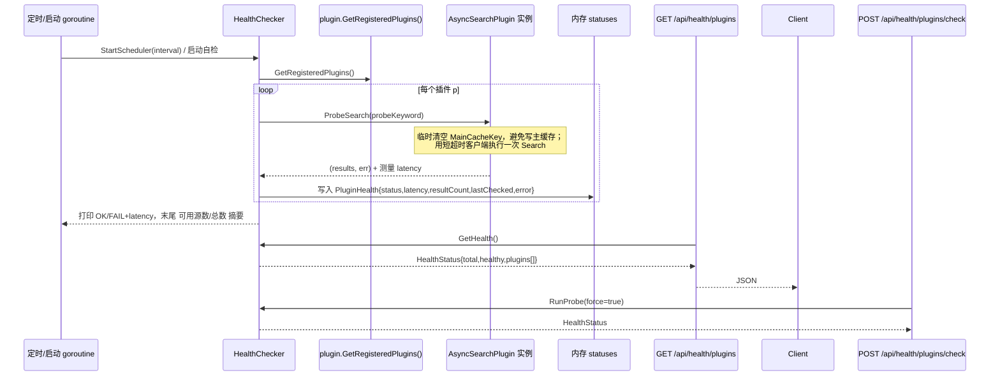
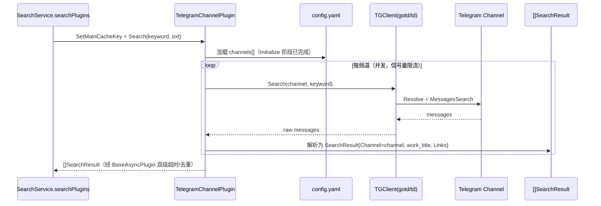
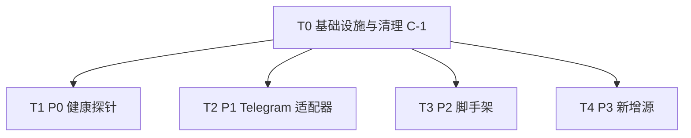

# PanSou 系统架构设计 + 任务分解（P0 源健康度 / P1 Telegram 适配器 / P2 脚手架 / P3 新增源 / C-1 清理）

> 作者：架构师 Bob（高见远） ｜ 依据：PM 的简化 PRD + 现有代码库（已逐文件阅读 `plugin.go` / `config.go` / `main.go` / `router.go` / `model/*` / `service/search_service.go` / `plugin/qqpd/*` / `plugin/nyaa/*` / `go.mod`）
>
> 设计原则：不破坏现有可插拔 `AsyncSearchPlugin` 架构；所有新功能以"新增包 / 修改最小面"方式落地；探针与业务缓存隔离；Telegram 适配器复用 `BaseAsyncPlugin` 的异步/双级超时/工作池/去重。

---

## 一、实现方案与框架选型（含 6 项架构决策结论）

### 决策 1：P0 健康探针的代码归属与生命周期

- **归属**：新建独立包 `pansou/health/`（不并入 `plugin` 包）。理由：`plugin` 包是插件契约层，健康探针属于"运维可观测性"横切关注点，独立包避免污染插件契约；同时探针需要直接依赖 `plugin.GetRegisteredPlugins()` 与 `BaseAsyncPlugin.ProbeSearch`，放在 `health` 包可避免 `plugin`↔`health` 的循环依赖（`plugin` 不依赖 `health`）。
- **调度 goroutine 启动位置**：在 `main.go` 的 `initApp()` 末尾调用 `health.StartScheduler()`；`initApp()` 已经 `config.Init()` → `plugin.InitAsyncPluginSystem()`，全局注册表（由各插件 `init()` 空导入填充）此时已就绪。
- **探针如何拿到全部插件**：使用 `plugin.GetRegisteredPlugins()`（全局注册表，含所有通过 `init()` 自注册的插件，**不**受 `EnabledPlugins` 过滤影响）。这样运维能看到"所有源"的健康度，而不仅是当前启用的源。
- **探针关键词**：固定常量 `ProbeKeyword = "测试"`（可通过 `HEALTH_CHECK_INTERVAL` 同类新增配置 `HEALTH_CHECK_PROBE_KEYWORD` 覆盖）。使用固定词，不污染业务统计。
- **结果存储**：**仅内存**（`health.HealthChecker` 内 `sync.Map`/带锁 map），本期不落盘；启动时打印摘要，运行时通过 API 读取。后续可加 Prometheus/落盘，不在本期范围。
- **关键改造（必做）**：在 `plugin.BaseAsyncPlugin` 上新增 **`ProbeSearch(keyword string) ([]model.SearchResult, error)`** 方法（详见第三节签名）。该方法临时把 `MainCacheKey` 置空、再调用 `p.Search(...)`，从而**完全避免写入主缓存（业务磁盘缓存）**；调用结束后恢复。这是"探针不污染业务缓存"的稳固实现点。

### 决策 2：P1 Telegram 客户端选型

- **结论：采用 MTProto 用户态客户端 `github.com/gotd/td`（预生成绑定，无需本地 codegen）**，因为只有 MTProto 能搜索/读取**频道历史消息**（Bot API 只能处理发往 Bot 的更新，无法满足"按关键词搜频道"的源需求）。
- **为什么不是 Bot API**：Bot 无法读取公开频道历史，不满足 PRD 的"频道式搜索"本质，故仅作为未来可选增强，不作为主路径。
- **为什么编译风险低**：`github.com/gotd/td` 发布的是**已预生成（pre-generated）**的 `telegram`/`tg` 包，直接 `go get` 即可使用，**不需要在构建期运行 codegen**；仅需确保 `go mod` 能拉到该依赖（实现时用 `go mod tidy` 锁定版本）。
- **运行期门槛（用户负责，见第八节）**：MTProto 需要 `api_id` / `api_hash`（my.telegram.org 申请）与一次性登录生成的 `session` 文件。为**保证 `go build` 永远通过且启动不阻断**，Telegram 插件采用**惰性初始化 + 配置门控**：
  - `Initialize()` 读取 `TG_API_ID`/`TG_API_HASH`/`TG_SESSION_PATH`；若缺失，`Initialize()` 不报错，仅把 `client` 置为 `nil`，插件照常注册；
  - 实际搜索/探针时若 `client == nil`，返回明确错误 `[telegram] 未配置 TG 凭据或未登录`，探针将其标记为 `fail` 并附原因——**不影响其他源与启动**；
  - 登录流程（一次性、交互式 `gotd` 会话）→ 生成 `session` 文件，由用户在部署侧完成（文档化步骤）。
- **配置加载**：频道配置放 `pansou/plugin/telegram/config.yaml`（随插件提供，可被 `TG_CONFIG_PATH` 环境变量指向外部文件覆盖）；`api_id/api_hash/session` 走环境变量（不进仓库）。

### 决策 3：P1 配置加载与 Schema

- 文件：`pansou/plugin/telegram/config.yaml`。
- Schema（YAML，每频道）：

```yaml
# pansou/plugin/telegram/config.yaml
# 全局 API 凭据优先读环境变量 TG_API_ID / TG_API_HASH / TG_SESSION_PATH（此处仅作说明占位）
api:
  session_path: ""          # 留空则读 TG_SESSION_PATH；也可直接写绝对路径
channels:
  - channel: "myresourcetg" # 频道用户名（可带或不带 @ 均可，加载时统一规范化）
    cloud_type: "quark"     # 该频道主要分享的网盘类型，用于标签/过滤（quark/uc/baidu/...）
    keyword_map:            # 可选：该频道关注的类别关键词（仅作记录/未来扩展，不参与硬过滤）
      - "电影"
      - "剧集"
    enabled: true
  - channel: "anotherchannel"
    cloud_type: "uc"
    enabled: true
```

- **必填校验**：`channel` 为空 → 加载失败并 `return error`（由 `Initialize()` 捕获，插件标记为 unhealthy，不阻断启动）；`enabled` 缺省视为 `true`；`cloud_type` 缺省为空串（结果仍返回，仅标签为空）。
- Schema 字段对应结构体：`TelegramChannelConfig{ Channel, CloudType string; KeywordMap []string; Enabled bool }`、`TelegramAPIConfig{ APIID, APIHash, SessionPath string }`。

### 决策 4：P2 脚手架实现形态

- **形态**：`Makefile` 新增 `newplugin` 目标，调用 `pansou/scripts/newplugin.sh NAME=xxx`。
- **生成物**：在 `plugin/<name>/` 下生成 `<name>.go` 桩代码，内含：
  - `init()` 中 `plugin.RegisterGlobalPlugin(NewXxxPlugin())` 示例；
  - 标准请求头 / 重试 / 关键词过滤占位（`NewBaseAsyncPlugin` / `NewBaseAsyncPluginWithFilter` 二选一提示）；
  - `Search` / `SearchWithResult` / `searchImpl` 骨架；
  - 顶部注释提示"别忘了在 `main.go` 加 `_ \"pansou/plugin/<name>\"` 空导入"。
- **退出码**：`NAME` 缺失或 `plugin/<name>` 已存在 → 打印错误并 `exit 1`。
- **文档**：更新 `docs/pansou-plugin-developer-SKILL.md` 增加"快速生成插件"章节。

### 决策 5：P3 新增源清单（文件级，标注 L1/L2/L3 优先级档位）

> 规则：优先选有 JSON API / 结构稳定的源；只能 HTML 抓取的给出 goquery 解析策略；**最终存活与否以 P0 探针验证为准**，探针不通过的源在 PRD 验收前从 `main.go` 空导入移除。

| 类别 | 包名（目录/文件） | 档位 | 检索方式 | 备注 |
|---|---|---|---|---|
| 电子书/学术 | `plugin/annasarchive/annasarchive.go` | L1 | HTML 抓取（annas-archive.org 搜索页，goquery）+ 详情 | 结构较稳定 |
| 电子书/学术 | `plugin/libgen/libgen.go` | L1 | HTML/直链（libgen.is / libgen.st 搜索） | 直链友好 |
| 电子书/学术 | `plugin/zlibrary/zlibrary.go` | L2 | HTML 抓取（z-lib 登录墙，需代理） | 可靠性低，探针验证 |
| 软件/ISO | `plugin/rutracker/rutracker.go` | L2 | HTML 抓取（rutracker.org 搜索，需代理） | 覆盖软件/ISO |
| 漫画 manhua | `plugin/manhuagui/manhuagui.go` | L1 | HTML 抓取（manhuagui.com 搜索，国内可达） | 结构稳定 |
| 国际 BT 索引器 | `plugin/1337x/1337x.go` | L1 | HTML 抓取（1337x.to，结构清晰） | 覆盖 软件/ISO/音乐/影视 |
| 国际 BT 索引器 | `plugin/torrentgalaxy/torrentgalaxy.go` | L2 | HTML 抓取（torrentgalaxy.to） | 覆盖 音乐/影视 |
| 国际 BT 索引器 | `plugin/limetorrents/limetorrents.go` | L2 | HTML 抓取（limetorrents.lol） | 覆盖 综合 |

- **满足度核对**：电子书≥2（annas, libgen, +zlibrary）；软件/ISO≥1（rutracker，并由 1337x 软件类补充）；音乐≥1（1337x/torrentgalaxy 音乐类目）；漫画≥1（manhuagui）；国际 BT≥2（1337x, torrentgalaxy, limetorrents，均 HTML 抓取，优先 JSON 的难度较高，故统一走 goquery 并保证解析健壮）。
- **磁力/宽泛源约定**：BT 类与 rutracker 用 `NewBaseAsyncPluginWithFilter(name, priority, true)`（跳过 Service 过滤）+ 插件内 `plugin.FilterResultsByKeyword` 用实际搜索词过滤；其余中文网盘类用 `NewBaseAsyncPlugin(name, priority)`（走 Service 过滤）。

### 决策 6：pioz 清理（C-1）

- 实测 `pansou/plugin/pioz/` 仅含一个 `1.txt`，**未被 `main.go` 空导入**（已 grep 确认无引用）。
- 直接删除目录即可；编译与启动无影响。放入 T0（基础设施）任务首步执行，作为"清理 + 地基"的一部分。

---

## 二、文件清单（相对路径，新增 / 修改标注）

### 基础设施 / 清理（T0）
- `pansou/plugin/pioz/` — **删除**（C-1）
- `pansou/config/config.go` — **修改**：新增 `HealthCheckInterval`/`HealthCheckIntervalSeconds`/`HealthCheckProbeKeyword` + `TGAPIID`/`TGAPIHash`/`TGSessionPath`/`TGConfigPath` 字段、`Init()` 赋值、对应 env getter
- `pansou/plugin/plugin.go` — **修改**：`BaseAsyncPlugin` 新增 `ProbeSearch(keyword string) ([]model.SearchResult, error)`

### P0 源健康度探针（T1）
- `pansou/health/health.go` — **新增**：`HealthChecker` / `HealthStatus` / `PluginHealth` / `ProbeSearch` 调用封装 / `GET & POST` 路由注册函数 `RegisterHealthRoutes` / `RunProbe` / `StartScheduler` / `GetHealth`
- `pansou/api/router.go` — **修改**：在 `SetupRouter` 中调用 `health.RegisterHealthRoutes(api)`
- `pansou/main.go` — **修改**：`initApp()` 末尾 `health.StartScheduler()`；`import _ "pansou/health"` 不需要（health 由 router 引用即可，但 scheduler 需显式调用，故保证 import 可达）

### P1 通用 Telegram 频道适配器（T2）
- `pansou/plugin/telegram/telegram.go` — **新增**：`TelegramChannelPlugin`（实现 `AsyncSearchPlugin`，内嵌 `BaseAsyncPlugin`）
- `pansou/plugin/telegram/config.yaml` — **新增**：频道配置（见决策 3）
- `pansou/plugin/telegram/README.md` — **新增（可选但建议）**：凭据申请 + 一次性登录步骤
- `pansou/main.go` — **修改**：新增 `_ "pansou/plugin/telegram"` 空导入
- `pansou/go.mod` — **修改**：新增 `github.com/gotd/td`（及传递依赖，经 `go mod tidy`）

### P2 插件脚手架（T3）
- `pansou/scripts/newplugin.sh` — **新增**：生成器脚本
- `pansou/Makefile` — **新增**：`newplugin` 目标（仓库根 `pansou/` 下）
- `docs/pansou-plugin-developer-SKILL.md` — **修改**：补充"快速生成插件"章节

### P3 新增搜索源（T4）
- `pansou/plugin/annasarchive/annasarchive.go`（L1）
- `pansou/plugin/libgen/libgen.go`（L1）
- `pansou/plugin/zlibrary/zlibrary.go`（L2）
- `pansou/plugin/rutracker/rutracker.go`（L2）
- `pansou/plugin/manhuagui/manhuagui.go`（L1）
- `pansou/plugin/1337x/1337x.go`（L1）
- `pansou/plugin/torrentgalaxy/torrentgalaxy.go`（L2）
- `pansou/plugin/limetorrents/limetorrents.go`（L2）
- `pansou/main.go` — **修改**：为上述 8 个包各加一行 `_ "pansou/plugin/<pkg>"` 空导入

---

## 三、数据结构 / 类图（Mermaid）

> 完整 class 图另存 `docs/class-diagram.mermaid`。



---

## 四、调用时序图（Mermaid）

> 完整 sequence 图另存 `docs/sequence-diagram.mermaid`。

### 4.1 P0 探针触发流程（定时 / 启动自检 / 手动）



### 4.2 P1 Telegram 搜索流程



---

## 五、有序任务列表（T0→T4，按依赖）

> 顶层 5 个任务（满足"基础设施先行 + 每任务≥3 文件 + 依赖清晰"）。T4 内含 P3 八源的子步骤与 L 档位；所有新源必须经 P0 探针验证。

### T0 — 基础设施与清理（C-1 + 配置 + ProbeSearch 地基）【P0，无前置】
- **描述**：删除空壳 `pioz`；在 `config.go` 新增健康探针与 TG 相关配置字段/取值/getter；在 `plugin.go` 的 `BaseAsyncPlugin` 增加 `ProbeSearch`（临时清空 `MainCacheKey` 调 `Search`，隔离主缓存）。本任务是 T1/T2/T4 的前置。
- **涉及文件**：`pansou/plugin/pioz/`（删除）、`pansou/config/config.go`（改）、`pansou/plugin/plugin.go`（改）
- **依赖**：无
- **优先级**：P0
- **验收**：`go build ./...` 通过；`pioz` 目录消失；`ProbeSearch` 单测（对 mock 插件）确认不写主缓存。

### T1 — P0 源健康度探针【P0，依赖 T0】
- **描述**：实现 `health` 包：内存状态表 + `RunProbe`/`GetHealth`/`StartScheduler`；在 `router.go` 注册 `GET /api/health/plugins` 与 `POST /api/health/plugins/check`；`main.go` 的 `initApp()` 启动调度，并在 `startServer` 打印启动自检日志（逐插件 OK/FAIL+latency + 可用源数/总数，失败不阻断启动）。
- **涉及文件**：`pansou/health/health.go`（新）、`pansou/api/router.go`（改）、`pansou/main.go`（改）
- **依赖**：T0
- **优先级**：P0
- **验收**：启动日志含各源 OK/FAIL 与摘要；`GET` 返回 `name/status/latency/resultCount/lastChecked`，失败含 `error`；`POST` 可手动触发全量重测；探针不污染业务缓存（主缓存无 `测试` 关键词条目）。

### T2 — P1 通用 Telegram 频道适配器【P1，依赖 T0】
- **描述**：实现 `TelegramChannelPlugin`（内嵌 `BaseAsyncPlugin`，单实例配置驱动多频道）；`config.yaml` 频道 Schema + 必填校验；`gotd/td` 惰性初始化与凭据门控（缺失则 unhealthy 不崩溃）；`main.go` 加空导入；`go.mod` 加依赖。正确填充 `SearchResult.Channel`（频道 handle）与 `work_title`。
- **涉及文件**：`pansou/plugin/telegram/telegram.go`（新）、`pansou/plugin/telegram/config.yaml`（新）、`pansou/plugin/telegram/README.md`（新）、`pansou/main.go`（改）、`pansou/go.mod`（改）
- **依赖**：T0
- **优先级**：P1
- **验收**：`go build ./...` 通过；无凭据时启动不崩溃、探针标 fail 带原因；配齐凭据+session 后能经 P0 探针返回结果。

### T3 — P2 插件脚手架脚本【P1/P2，依赖 T0】
- **描述**：`Makefile` 新增 `newplugin` 目标 → `scripts/newplugin.sh NAME=xxx`；生成 `plugin/<name>/<name>.go` 桩（含 `init()` 注册示例、标准请求头/重试/关键词过滤占位、main.go 空导入提示注释）；`NAME` 缺失/重名 `exit 1`；更新开发者 SKILL 文档。
- **涉及文件**：`pansou/scripts/newplugin.sh`（新）、`pansou/Makefile`（新）、`docs/pansou-plugin-developer-SKILL.md`（改）
- **依赖**：T0（建议参考 T1/T2 完成后的真实桩样式）
- **优先级**：P2
- **验收**：`make newplugin NAME=foo` 生成可独立 `go build ./plugin/foo` 的桩；缺 `NAME`/重名退出码非零；SKILL 文档含用法。

### T4 — P3 新增搜索源【P3，依赖 T0】
- **描述**：按 L 档位顺序实现 8 个源插件（见决策 5 表），每个遵循 `AsyncSearchPlugin` 契约与共享约定；`main.go` 加 8 行空导入；实现后用 P0 探针逐一验证存活，不通过者暂不接入或标注。
- **涉及文件**：
  - L1：`plugin/annasarchive/annasarchive.go`、`plugin/libgen/libgen.go`、`plugin/manhuagui/manhuagui.go`、`plugin/1337x/1337x.go`
  - L2：`plugin/zlibrary/zlibrary.go`、`plugin/rutracker/rutracker.go`、`plugin/torrentgalaxy/torrentgalaxy.go`、`plugin/limetorrents/limetorrents.go`
  - `pansou/main.go`（改，8 行空导入）
- **依赖**：T0（每源独立，可并行；建议先 L1 后 L2）
- **优先级**：P3
- **验收**：每个新源 `go build ./...` 通过；`GET /api/health/plugins` 中对应源 `status=ok` 且 `resultCount>0`（以探针为准）；`Channel` 为空串、`UniqueID` 以插件名前缀、`Links` 非空。

### 任务依赖图（Mermaid）



---

## 六、依赖包列表（含 P1 新增 TG 库）

- **现有（go.mod 已含，复用）**：`github.com/gin-gonic/gin`、`github.com/PuerkitoBio/goquery`（HTML 解析）、`pansou/util/json`（sonic 封装）、`gopkg.in/yaml.v3`（YAML 配置解析，go.mod 已为 indirect，升级为 direct）、`golang.org/x/net` 等。
- **P1 新增（必须显式加入 go.mod 并 `go mod tidy`）**：
  - `github.com/gotd/td` —— Telegram MTProto 客户端（**预生成绑定，无需构建期 codegen**）。建议版本以 `go get github.com/gotd/td@latest` 解析的稳定版为准并锁定（实现时执行 `go mod tidy`）。
  - 传递依赖由 `go mod tidy` 自动补充（gotd 会引入 `go.uber.org/zap`、`github.com/cenkalti/backoff/v4` 等，无需手填）。
- **P2/P3 不引入新第三方依赖**（复用 goquery + util/json + yaml.v3）。

---

## 七、共享约定（跨文件 / 跨插件）

1. **插件命名**：包名 = 源 id；`Name()` 返回同一 id（小写，无空格）；`init()` 内 `plugin.RegisterGlobalPlugin(NewXxxPlugin())` 仅一次。
2. **优先级档位**：1=高，2=好，3=普通，4+=低/风险。`telegram` 用 3；BT/宽泛源用 3；电子书/漫画 L1 用 2~3。
3. **错误包装格式**：`fmt.Errorf("[%s] 描述: %w", p.Name(), err)`（中括号包插件名，便于日志溯源）。
4. **`Link.Type` 常量**（与现有一致）：`quark`/`uc`/`baidu`/`aliyun`/`guangya`/`xunlei`/`tianyi`/`115`/`123`/`mobile`/`pikpak`/`magnet`/`ed2k`/`others`。
5. **`Channel` 字段规则**：普通插件结果 `Channel = ""`；**`TelegramChannelPlugin` 例外**——填频道 handle（如 `@myresourcetg`），以契合 PRD P1-3 与 `qqpd` 既有行为；同时正确填 `work_title`（一条消息含多作品时区分）。
6. **`UniqueID` 规则**：`fmt.Sprintf("%s-%s", p.Name(), id)`，稳定且全局唯一。
7. **结果必须有链接**：`len(result.Links) > 0` 才返回（与 `searchPlugins` 的过滤一致）。
8. **过滤策略**：中文网盘类走 Service 过滤（`NewBaseAsyncPlugin`）；磁力/BT/宽泛源用 `NewBaseAsyncPluginWithFilter(..., true)` + 插件内 `plugin.FilterResultsByKeyword(实际搜索词)`。
9. **HTTP 规范**：使用带 `context` 超时请求、真实 `User-Agent`、克隆请求重试、关闭响应体；限流用 `semaphore channel`；详情页并发有界。
10. **配置读取**：所有新增配置走 `config` 包 env getter，`health`/`telegram` 不直接读 env。
11. **主缓存隔离**：任何"只读/探测"路径（探针、健康检查）不得写入主缓存；统一经 `BaseAsyncPlugin.ProbeSearch` 实现。

---

## 八、待明确事项（已转为明确结论或需用户补充项）

1. **Telegram 凭据与一次性登录（用户补充，关键）**：需用户提供 `api_id` / `api_hash`（my.telegram.org 申请），并在部署侧用 `gotd` 交互式登录生成 `session` 文件（路径由 `TG_SESSION_PATH` 指定）。我将把详细步骤写入 `plugin/telegram/README.md`。**若用户无法提供凭据，Telegram 源将保持"已注册但 unhealthy"状态，不影响其余功能。**
2. **`HEALTH_CHECK_INTERVAL` 默认值**：建议默认 `30m`（分钟），`0` 表示关闭定时（仅启动自检 + 手动）。如需不同默认请确认。
3. **探针关键词 `"测试"` 对境外源的适配**：部分境外源对中文"测试"可能返回 0 结果或解析异常。设计上 `status=ok` 仅要求"请求成功无错"，`resultCount` 可为 0；若某源对"测试"必错，工程师可在该源 `searchImpl` 对探针态（`ext["health_probe"]==true`）改用英文 fallback 词（如 `"test"`）。是否统一采用 `ext["health_probe"]` 透传探针标志由各源自行决定（非强制）。
4. **`Channel` 字段例外**：Telegram 源填频道 handle，与 SKILL 文档"插件结果 Channel 必须为空"冲突——本设计**明确推翻该条对 Telegram 源的适用**，理由见第七节第 5 条。若团队坚持 SKILL 原文，则 Telegram 结果 `Channel` 置空、改由 `Tags` 标注频道（需 PM 拍板）。
5. **`gotd/td` 拉取环境**：若构建环境无法访问 proxy.golang.org 或 github，需提前 `go mod download` 或启用 `GOPROXY`；实现时由工程师执行 `go mod tidy` 并验证 `go build ./...`。
6. **P3 源最终取舍**：上表 8 个为候选；以 P0 探针实测存活为准，存活不足时按 L1→L2 顺序补足同类目（如 1337x 已稳则不必强求 limetorrents，但国际 BT 至少保留 2 个稳定源）。
7. **pioz 删除确认**：已确认 `pioz/` 仅含 `1.txt` 且 `main.go` 未导入，删除零风险（C-1）。

---

## 九、关键签名 / 伪代码（非完整实现）

### plugin.go — 新增 ProbeSearch（隔离主缓存）

```go
// ProbeSearch 供健康探针使用：执行一次搜索但不写入主缓存（业务缓存）
// 通过临时清空 MainCacheKey 实现；调用结束后恢复。短超时由 BaseAsyncPlugin 客户端保证。
func (p *BaseAsyncPlugin) ProbeSearch(keyword string) ([]model.SearchResult, error) {
    saved := p.MainCacheKey
    p.MainCacheKey = ""               // 阻止 AsyncSearchWithResult 写主缓存
    defer func() { p.MainCacheKey = saved }()
    return p.Search(keyword, map[string]interface{}{
        "health_probe": true,
        "refresh":      true,         // 探针不命中业务缓存，走真实请求
    })
}
```

### health/health.go — 核心结构（伪代码）

```go
package health

type PluginHealth struct {
    Name        string `json:"name"`
    Status      string `json:"status"`       // "ok" | "fail"
    LatencyMs   int64  `json:"latency"`
    ResultCount int    `json:"resultCount"`
    LastChecked int64  `json:"lastChecked"`  // unix ms
    Error       string `json:"error,omitempty"`
}

type HealthStatus struct {
    Total   int            `json:"total"`
    Healthy int            `json:"healthy"`
    Plugins []PluginHealth `json:"plugins"`
}

type HealthChecker struct {
    mu           sync.RWMutex
    statuses     map[string]PluginHealth
    probeKeyword string
    interval     time.Duration
}

func NewHealthChecker() *HealthChecker
func (h *HealthChecker) RunProbe()                       // 遍历 plugin.GetRegisteredPlugins()，逐个 ProbeSearch
func (h *HealthChecker) GetHealth() HealthStatus
func (h *HealthChecker) StartScheduler(interval time.Duration)  // go ticker -> RunProbe
func RegisterHealthRoutes(api *gin.RouterGroup)          // GET /api/health/plugins ; POST /api/health/plugins/check
```

### plugin/telegram/telegram.go — 核心结构（伪代码）

```go
package telegram

type TelegramChannelConfig struct {
    Channel    string   `yaml:"channel"`
    CloudType  string   `yaml:"cloud_type"`
    KeywordMap []string `yaml:"keyword_map"`
    Enabled    bool     `yaml:"enabled"`
}

type TelegramChannelPlugin struct {
    *plugin.BaseAsyncPlugin
    channels []TelegramChannelConfig
    client   TGClient          // gotd/td 封装；nil 表示未配置
    mu       sync.RWMutex
}

func init() { plugin.RegisterGlobalPlugin(NewTelegramPlugin()) }
func NewTelegramPlugin() *TelegramChannelPlugin { /* NewBaseAsyncPlugin("telegram", 3) */ }

// Initialize 加载 config.yaml（TG_CONFIG_PATH 可覆盖）；读 TG_API_ID/Hash/Session；
// 缺失则 client=nil（不报错，插件 unhealthy）。
func (p *TelegramChannelPlugin) Initialize() error

func (p *TelegramChannelPlugin) Search(keyword string, ext map[string]interface{}) ([]model.SearchResult, error)
func (p *TelegramChannelPlugin) SearchWithResult(...) (model.PluginSearchResult, error)
func (p *TelegramChannelPlugin) searchImpl(client *http.Client, keyword string, ext map[string]interface{}) ([]model.SearchResult, error)
// 内部：每频道并发(semaphore) -> client.Search(channel, keyword) -> 解析消息为
//   model.SearchResult{ Channel: "@"+channel, WorkTitle: ..., Links: [...] }
```

### scripts/newplugin.sh（骨架示意）

```bash
#!/usr/bin/env bash
set -euo pipefail
NAME="${NAME:-$2}"
[ -z "$NAME" ] && { echo "用法: make newplugin NAME=xxx"; exit 1; }
[ -d "plugin/$NAME" ] && { echo "已存在: plugin/$NAME"; exit 1; }
mkdir -p "plugin/$NAME"
cat > "plugin/$NAME/$NAME.go" <<EOF
package $NAME
import "pansou/plugin"
import "pansou/model"
// 别忘了在 main.go 加: _ "pansou/plugin/$NAME"
func init() { plugin.RegisterGlobalPlugin(New${NAME^}Plugin()) }
... // Search/SearchWithResult/searchImpl 骨架 + 标准请求头/重试占位
EOF
echo "已生成 plugin/$NAME/$NAME.go"
```
